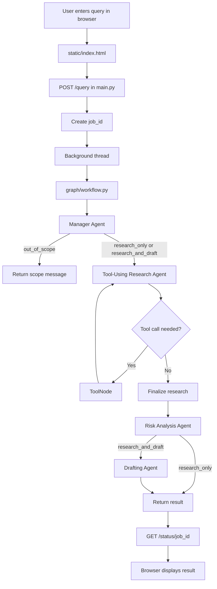

# Milestone 1 — Agent Foundation Development

### Project: Automated Enterprise Legal & Compliance Workflow System

# Agile documentation for your reference.
- [Agile Documentation Sheet 1](https://docs.google.com/spreadsheets/d/1qOnqI21ksRY6J5UNZIjFbSMVg5eBb623yxsqVyT7-Nk/edit?usp=sharing)
- [Agile Documentation Sheet 2](https://docs.google.com/spreadsheets/d/1BB0N4jOuBphVZ4GsUnnPzYoYj2IJBlYZ/edit?usp=sharing&ouid=116718011743655261611&rtpof=true&sd=true)
- [Agile Documentation Sheet 3](https://docs.google.com/spreadsheets/d/12MiNxLmrmoSlD3EEVdP08wuH2aw84TuwhLnHOEumQHo/edit?usp=sharing)
 
## What's in this folder
- `agent.py` — the agent code (`ComplianceAssistantAgent`) — this is your core deliverable
- `dashboard.py` — visual web dashboard for presenting/demoing the agent
- `requirements.txt` — packages to install
- `.env.example` — rename to `.env` and add your Groq API key here

 ## project Screenshot





## How to run it (step by step)
 
1. Open a terminal inside this folder.
2. Create and activate a virtual environment:
```
   python -m venv venv
   venv\Scripts\activate        # Windows
   source venv/bin/activate     # Mac/Linux
```
3. Install the packages:
```
   pip install -r requirements.txt
```
4. Get a free Groq API key at https://console.groq.com
5. Rename `.env.example` to `.env` and paste in your key.
6. Run the terminal version:
```
   python agent.py
```
   Or run the visual dashboard version (recommended for presenting):
```
   streamlit run dashboard.py
```
7. Try asking:
   - "What are our obligations under the DPDP Act for storing employee data?"
   - "Summarize POSH Act requirements for setting up an Internal Committee"
   - "What compliance filings does a private limited company need annually under the Companies Act 2013?"

## How this maps to the Milestone 1 tasks
| Task from project doc | Where it is in the code |
|---|---|
| Configure LangChain and dependencies | `requirements.txt`, imports + `.env` loading at top of `agent.py` |
| Develop foundational AI agent | `ComplianceAssistantAgent` class |
| Prompt templates and interaction workflows | `self.prompt_template` and `handle_request()` |
| Basic testing interface | `run_cli()` in `agent.py`, plus `dashboard.py` for a visual version |

---

# Milestone 2 - Multi-Agent Legal and Compliance System

Milestone 2 extends the original assistant into an **Enterprise Legal & Compliance Multi-Agent Workflow System**. It combines specialized agents, retrieval-augmented generation (RAG), deterministic contract-risk analysis, live web search, and an external company-registry API.

The system is designed for legal and compliance **research support**. It provides grounded findings and workflow assistance; it is not a replacement for advice from a qualified lawyer.

## Current Features

- Natural-language legal and compliance question handling through a Groq-hosted LLM.
- Manager Agent routing for research, research plus drafting, and out-of-scope requests.
- Tool-using Research Agent that can select one or more tools in sequence.
- Internal PDF search using embeddings and a persistent ChromaDB vector store.
- Live regulatory search using DuckDuckGo Search (`ddgs`) or Tavily when `TAVILY_API_KEY` is configured.
- Deterministic contract and clause risk scoring from auditable keyword rules.
- Company-registration verification through the OpenCorporates REST API.
- Drafting Agent for notices, letters, and other requested compliance documents.
- Risk Analysis Agent that summarizes risk level, factors, and urgency.
- PDF upload and explicit knowledge-base rebuild controls.
- Background query jobs with step-by-step workflow progress.
- FastAPI backend and browser dashboard.
- Graceful error handling and a maximum tool-iteration limit to prevent infinite tool loops.

## Architecture

```text
Browser Dashboard
   |
   v
FastAPI (main.py)
   |
   v
Manager Agent
   |
   +--> Out of scope response
   |
   v
Tool-Using Research Agent <--> LangGraph ToolNode
   |                         |
   |                         +--> Internal PDF / ChromaDB search
   |                         +--> Live regulatory web search
   |                         +--> Deterministic risk calculator
   |                         +--> OpenCorporates company API
   v
Risk Analysis Agent
   |
   +--> Drafting Agent (only when a document is requested)
```

The workflow is defined in `graph/workflow.py`. It loops between the Research Agent and the selected tools until the agent produces a final response or the safety limit is reached.

## Agents

| Agent | Responsibility | Main file |
|---|---|---|
| Manager Agent | Classifies the user's intent and chooses the workflow route | `agents/manager_agent.py` |
| Tool-Using Research Agent | Selects and calls tools, then produces research findings | `agents/tool_using_research_agent.py` |
| Risk Analysis Agent | Summarizes risk level, key factors, and urgency | `agents/risk_analysis_agent.py` |
| Drafting Agent | Creates a requested notice, letter, memo, or similar document | `agents/drafting_agent.py` |

Routing is based on the meaning of the complete user question. Users do not need to copy exact keywords from the sample policy document.

## Tools and External Integrations

All production tools are defined in `tools.py` and are registered in `ALL_TOOLS`.

### 1. Internal legal-clause retrieval

`retrieve_legal_clauses(query)` searches the company's indexed PDFs. Documents are loaded, split into chunks, converted into embeddings using `sentence-transformers/all-MiniLM-L6-v2`, and stored in ChromaDB. Results include the source filename and page number where available.

### 2. Live regulatory search

`search_regulatory_updates(query)` searches the internet for recent Indian legal and regulatory information.

- Default provider: DuckDuckGo through the `ddgs` package.
- Optional provider: Tavily when `TAVILY_API_KEY` is present in `.env`.
- Results include titles, URLs, and short snippets.

### 3. Deterministic compliance-risk scoring

`calculate_compliance_risk_score(contract_text)` is a non-LLM scoring tool. It looks for auditable clause patterns such as indemnity, unlimited liability, personal data, data breach, governing law, arbitration, and force majeure, then returns a score from 0 to 100 with contributing factors.

### 4. External company verification API

`verify_corporate_entity(company_name, jurisdiction_code="in")` sends an HTTP request with `requests` to:

```text
https://api.opencorporates.com/v0.4/companies/search
```

The company name is supplied at runtime, so the feature is not limited to Tata Consultancy Services. It can be used for Infosys, Wipro, Reliance Industries, a vendor, or another company supported by the registry. The response may include company name, current status, incorporation date, and company number.

## Knowledge Base and Rebuild Index

Put compliance PDFs in the `documents/` folder. The sample policy covers employee privacy, DPDP obligations, data retention, breach response, POSH compliance, Companies Act filings, and labour-code obligations.

The existing ChromaDB index can be reused between queries. Use **Rebuild Knowledge Base** after adding, changing, or deleting PDFs. Rebuilding reads all PDFs again, creates new chunks and embeddings, and updates the searchable index. It is not required for every query.

### Vector Search Flow

```text
documents/*.pdf
   |
   v
rag/document_loader.py
   |  extract text and split into chunks
   v
Hugging Face embedding model
   |  convert each chunk into a numerical vector
   v
chroma_db/
   |  persist vectors and document metadata
   v
User question -> query embedding -> similarity search -> relevant clauses
```

### Vector and ChromaDB Files

| Location | Purpose |
|---|---|
| `documents/` | Source compliance and legal PDF files |
| `rag/document_loader.py` | Loads PDFs and splits their text into searchable chunks |
| `rag/vector_store.py` | Creates, loads, and queries the ChromaDB vector store |
| `chroma_db/` | Persistent local ChromaDB data, including embeddings and metadata |
| `tools.py` | Exposes vector similarity search through `retrieve_legal_clauses` |

The vector store uses the `sentence-transformers/all-MiniLM-L6-v2` embedding model. An embedding represents the meaning of a text chunk as numbers. When a user asks a question, the question is embedded using the same model and ChromaDB returns the most semantically similar chunks. This means the user does not need to repeat the exact wording from the PDF.

`get_or_build_vector_store()` first loads the existing `chroma_db/` directory. If no index exists, it processes the PDFs and creates one. The `/rebuild-knowledge-base` endpoint explicitly rebuilds the store after document changes.

## FastAPI Endpoints

The backend is exposed by `main.py`:

| Method | Endpoint | Purpose |
|---|---|---|
| `GET` | `/health` | Checks server health and whether `GROQ_API_KEY` is configured |
| `POST` | `/upload` | Uploads one PDF into `documents/` |
| `GET` | `/documents` | Lists uploaded PDFs |
| `POST` | `/rebuild-knowledge-base` | Re-indexes all PDFs |
| `POST` | `/query` | Starts a background workflow job and returns a `job_id` |
| `GET` | `/status/{job_id}` | Returns progress logs and the completed result |
| `GET` | `/` | Serves the browser dashboard |

Example query request:

```json
{
  "query": "What should the company do after an employee data breach?"
}
```

The `/query` response returns a job ID immediately. The client polls `/status/{job_id}` until the status is `completed` or `failed`.

## How to Run Milestone 2

From the `Aiagent` folder on Windows:

```powershell
python -m venv venv
venv\Scripts\activate
pip install -r requirements.txt
```

Create a `.env` file in the project folder:

```env
GROQ_API_KEY=your_groq_api_key
# Optional:
# TAVILY_API_KEY=your_tavily_api_key
```

Start the FastAPI application:

```powershell
uvicorn main:app --reload --port 8000
```

Open the dashboard at [http://127.0.0.1:8000/](http://127.0.0.1:8000/). API documentation is available at [http://127.0.0.1:8000/docs](http://127.0.0.1:8000/docs).

The original Milestone 1 commands (`python agent.py` and `streamlit run dashboard.py`) are retained above for the earlier interface. The FastAPI command is the recommended command for the current multi-agent workflow.

## Demonstration Questions

These questions demonstrate different capabilities without relying on one hardcoded company or sentence:

```text
What should an organization do if an employee's personal information is exposed?
```

```text
Please assess this vendor clause: The supplier may use customer data, has unlimited liability, and can terminate the agreement whenever it chooses.
```

```text
Can you check whether Infosys is a legitimate registered business in India?
```

```text
Have there been any recent Indian regulatory updates affecting employee personal data?
```

The first question normally uses internal policy retrieval, the second uses risk scoring, the third uses the external company API, and the fourth uses live regulatory search. The LLM decides which tool is appropriate from the user's intent.

## Testing

Run the full test suite from the project folder:

```powershell
venv\Scripts\python.exe -m pytest -q
```

The tests cover deterministic risk scoring, empty-input validation, missing vector-store handling, search failure degradation, real ToolNode execution, and workflow safety behavior. Tests that exercise live LLM or external network decisions use mocks so they remain repeatable.

## Limitations and Responsible Use

- The system does not contain every Indian law, court judgment, or legal database.
- Internal answers are limited to the PDFs currently indexed in `documents/`.
- Live search and OpenCorporates depend on internet access, provider availability, rate limits, and returned data quality.
- A company not found by OpenCorporates is not proof that the company is unregistered; spelling and jurisdiction should be checked manually.
- Risk scoring is a transparent heuristic, not a legal opinion or a complete contract review.
- LLM responses can be incomplete or incorrect and should be verified against authoritative sources.
- Complex litigation, legal strategy, or final legal advice requires qualified legal review.
- Job state is stored in an in-memory Python dictionary and is lost when the server restarts.
- CORS is open for local demonstration; production deployment must restrict allowed origins.
- The current system is intended for a controlled demo or capstone environment, not unattended production legal decision-making.

## Troubleshooting

### The dashboard shows an old result

Stop and restart Uvicorn after changing Python files:

```powershell
Ctrl+C
uvicorn main:app --reload --port 8000
```

### The internal search returns no clauses

Confirm that a PDF exists in `documents/`, then call `POST /rebuild-knowledge-base` from the dashboard or `/docs`.

### A company query returns an API error

Check internet access, company spelling, and jurisdiction. The external registry may not contain every entity or may temporarily limit requests.

### The agent reports a Groq error

Confirm that `.env` contains a valid `GROQ_API_KEY` and that the virtual environment is active before starting Uvicorn.
 
