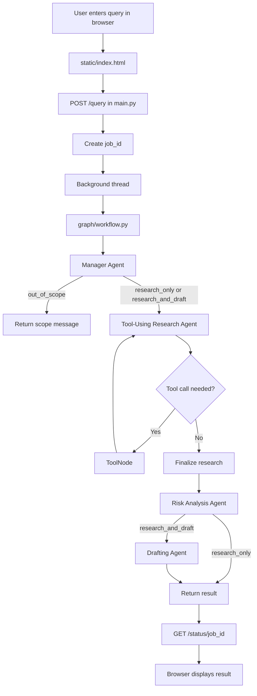

# Milestone 1 — Agent Foundation Development

### Project: Automated Enterprise Legal & Compliance Workflow System

# Agile documentation for your reference.
- [Agile Documentation Sheet 1](https://docs.google.com/spreadsheets/d/1qOnqI21ksRY6J5UNZIjFbSMVg5eBb623yxsqVyT7-Nk/edit?usp=sharing)
- [Agile Documentation Sheet 2](https://docs.google.com/spreadsheets/d/1BB0N4jOuBphVZ4GsUnnPzYoYj2IJBlYZ/edit?usp=sharing&ouid=116718011743655261611&rtpof=true&sd=true)
- [Agile Documentation Sheet 3](https://docs.google.com/spreadsheets/d/12MiNxLmrmoSlD3EEVdP08wuH2aw84TuwhLnHOEumQHo/edit?usp=sharing)
 
## What's in this folder
- `agent.py` — the agent code (`ComplianceAssistantAgent`) — this is your core deliverable
- `dashboard.py` — visual web dashboard for presenting/demoing the agent
- `requirements.txt` — packages to install
- `.env.example` — rename to `.env` and add your Groq API key here

 ## project Screenshot





## How to run it (step by step)
 
1. Open a terminal inside this folder.
2. Create and activate a virtual environment:
```
   python -m venv venv
   venv\Scripts\activate        # Windows
   source venv/bin/activate     # Mac/Linux
```
3. Install the packages:
```
   pip install -r requirements.txt
```
4. Get a free Groq API key at https://console.groq.com
5. Rename `.env.example` to `.env` and paste in your key.
6. Run the terminal version:
```
   python agent.py
```
   Or run the visual dashboard version (recommended for presenting):
```
   streamlit run dashboard.py
```
7. Try asking:
   - "What are our obligations under the DPDP Act for storing employee data?"
   - "Summarize POSH Act requirements for setting up an Internal Committee"
   - "What compliance filings does a private limited company need annually under the Companies Act 2013?"

## How this maps to the Milestone 1 tasks
| Task from project doc | Where it is in the code |
|---|---|
| Configure LangChain and dependencies | `requirements.txt`, imports + `.env` loading at top of `agent.py` |
| Develop foundational AI agent | `ComplianceAssistantAgent` class |
| Prompt templates and interaction workflows | `self.prompt_template` and `handle_request()` |
| Basic testing interface | `run_cli()` in `agent.py`, plus `dashboard.py` for a visual version |

---

# Milestone 2 - Multi-Agent Legal and Compliance System

Milestone 2 extends the original assistant into an **Enterprise Legal & Compliance Multi-Agent Workflow System**. It combines specialized agents, retrieval-augmented generation (RAG), deterministic contract-risk analysis, live web search, and an external company-registry API.

The system is designed for legal and compliance **research support**. It provides grounded findings and workflow assistance; it is not a replacement for advice from a qualified lawyer.

## Current Features

- Natural-language legal and compliance question handling through a Groq-hosted LLM.
- Manager Agent routing for research, research plus drafting, and out-of-scope requests.
- Tool-using Research Agent that can select one or more tools in sequence.
- Internal PDF search using embeddings and a persistent ChromaDB vector store.
- Live regulatory search using DuckDuckGo Search (`ddgs`) or Tavily when `TAVILY_API_KEY` is configured.
- Deterministic contract and clause risk scoring from auditable keyword rules.
- Company-registration verification through the OpenCorporates REST API.
- Drafting Agent for notices, letters, and other requested compliance documents.
- Risk Analysis Agent that summarizes risk level, factors, and urgency.
- PDF upload and explicit knowledge-base rebuild controls.
- Background query jobs with step-by-step workflow progress.
- FastAPI backend and browser dashboard.
- Graceful error handling and a maximum tool-iteration limit to prevent infinite tool loops.

## Architecture

```text
Browser Dashboard
   |
   v
FastAPI (main.py)
   |
   v
Manager Agent
   |
   +--> Out of scope response
   |
   v
Tool-Using Research Agent <--> LangGraph ToolNode
   |                         |
   |                         +--> Internal PDF / ChromaDB search
   |                         +--> Live regulatory web search
   |                         +--> Deterministic risk calculator
   |                         +--> OpenCorporates company API
   v
Risk Analysis Agent
   |
   +--> Drafting Agent (only when a document is requested)
```

The workflow is defined in `graph/workflow.py`. It loops between the Research Agent and the selected tools until the agent produces a final response or the safety limit is reached.

## Agents

| Agent | Responsibility | Main file |
|---|---|---|
| Manager Agent | Classifies the user's intent and chooses the workflow route | `agents/manager_agent.py` |
| Tool-Using Research Agent | Selects and calls tools, then produces research findings | `agents/tool_using_research_agent.py` |
| Risk Analysis Agent | Summarizes risk level, key factors, and urgency | `agents/risk_analysis_agent.py` |
| Drafting Agent | Creates a requested notice, letter, memo, or similar document | `agents/drafting_agent.py` |

Routing is based on the meaning of the complete user question. Users do not need to copy exact keywords from the sample policy document.

## Tools and External Integrations

All production tools are defined in `tools.py` and are registered in `ALL_TOOLS`.

### 1. Internal legal-clause retrieval

`retrieve_legal_clauses(query)` searches the company's indexed PDFs. Documents are loaded, split into chunks, converted into embeddings using `sentence-transformers/all-MiniLM-L6-v2`, and stored in ChromaDB. Results include the source filename and page number where available.

### 2. Live regulatory search

`search_regulatory_updates(query)` searches the internet for recent Indian legal and regulatory information.

- Default provider: DuckDuckGo through the `ddgs` package.
- Optional provider: Tavily when `TAVILY_API_KEY` is present in `.env`.
- Results include titles, URLs, and short snippets.

### 3. Deterministic compliance-risk scoring

`calculate_compliance_risk_score(contract_text)` is a non-LLM scoring tool. It looks for auditable clause patterns such as indemnity, unlimited liability, personal data, data breach, governing law, arbitration, and force majeure, then returns a score from 0 to 100 with contributing factors.

### 4. External company verification API

`verify_corporate_entity(company_name, jurisdiction_code="in")` sends an HTTP request with `requests` to:

```text
https://api.opencorporates.com/v0.4/companies/search
```

The company name is supplied at runtime, so the feature is not limited to Tata Consultancy Services. It can be used for Infosys, Wipro, Reliance Industries, a vendor, or another company supported by the registry. The response may include company name, current status, incorporation date, and company number.

## Knowledge Base and Rebuild Index

Put compliance PDFs in the `documents/` folder. The sample policy covers employee privacy, DPDP obligations, data retention, breach response, POSH compliance, Companies Act filings, and labour-code obligations.

The existing ChromaDB index can be reused between queries. Use **Rebuild Knowledge Base** after adding, changing, or deleting PDFs. Rebuilding reads all PDFs again, creates new chunks and embeddings, and updates the searchable index. It is not required for every query.

### Vector Search Flow

```text
documents/*.pdf
   |
   v
rag/document_loader.py
   |  extract text and split into chunks
   v
Hugging Face embedding model
   |  convert each chunk into a numerical vector
   v
chroma_db/
   |  persist vectors and document metadata
   v
User question -> query embedding -> similarity search -> relevant clauses
```

### Vector and ChromaDB Files

| Location | Purpose |
|---|---|
| `documents/` | Source compliance and legal PDF files |
| `rag/document_loader.py` | Loads PDFs and splits their text into searchable chunks |
| `rag/vector_store.py` | Creates, loads, and queries the ChromaDB vector store |
| `chroma_db/` | Persistent local ChromaDB data, including embeddings and metadata |
| `tools.py` | Exposes vector similarity search through `retrieve_legal_clauses` |

The vector store uses the `sentence-transformers/all-MiniLM-L6-v2` embedding model. An embedding represents the meaning of a text chunk as numbers. When a user asks a question, the question is embedded using the same model and ChromaDB returns the most semantically similar chunks. This means the user does not need to repeat the exact wording from the PDF.

`get_or_build_vector_store()` first loads the existing `chroma_db/` directory. If no index exists, it processes the PDFs and creates one. The `/rebuild-knowledge-base` endpoint explicitly rebuilds the store after document changes.

## FastAPI Endpoints

The backend is exposed by `main.py`:

| Method | Endpoint | Purpose |
|---|---|---|
| `GET` | `/health` | Checks server health and whether `GROQ_API_KEY` is configured |
| `POST` | `/upload` | Uploads one PDF into `documents/` |
| `GET` | `/documents` | Lists uploaded PDFs |
| `POST` | `/rebuild-knowledge-base` | Re-indexes all PDFs |
| `POST` | `/query` | Starts a background workflow job and returns a `job_id` |
| `GET` | `/status/{job_id}` | Returns progress logs and the completed result |
| `GET` | `/` | Serves the browser dashboard |

Example query request:

```json
{
  "query": "What should the company do after an employee data breach?"
}
```

The `/query` response returns a job ID immediately. The client polls `/status/{job_id}` until the status is `completed` or `failed`.

## How to Run Milestone 2

From the `Aiagent` folder on Windows:

```powershell
python -m venv venv
venv\Scripts\activate
pip install -r requirements.txt
```

Create a `.env` file in the project folder:

```env
GROQ_API_KEY=your_groq_api_key
# Optional:
# TAVILY_API_KEY=your_tavily_api_key
```

Start the FastAPI application:

```powershell
uvicorn main:app --reload --port 8000
```

Open the dashboard at [http://127.0.0.1:8000/](http://127.0.0.1:8000/). API documentation is available at [http://127.0.0.1:8000/docs](http://127.0.0.1:8000/docs).

### Deploying to a cloud host

The repository includes `Procfile` and `render.yaml` deployment configuration. For Render, create a Blueprint from this repository. Set these environment variables in the service dashboard: `GROQ_API_KEY`, `SUPABASE_URL`, and `SUPABASE_KEY`. `TAVILY_API_KEY` is optional.

The service must run with the platform-provided `PORT` and bind to `0.0.0.0`; do not use the local development command with `--reload` in production. Set `ALLOWED_ORIGINS` to the deployed dashboard origin as a comma-separated list. The `/health` response is `degraded` until both Groq and Supabase are configured. Uploaded PDFs and the in-memory job list use the instance filesystem, so use durable object storage and a shared job store before treating this as a production service.

The original Milestone 1 commands (`python agent.py` and `streamlit run dashboard.py`) are retained above for the earlier interface. The FastAPI command is the recommended command for the current multi-agent workflow.

## Demonstration Questions

These questions demonstrate different capabilities without relying on one hardcoded company or sentence:

```text
What should an organization do if an employee's personal information is exposed?
```

```text
Please assess this vendor clause: The supplier may use customer data, has unlimited liability, and can terminate the agreement whenever it chooses.
```

```text
Can you check whether Infosys is a legitimate registered business in India?
```

```text
Have there been any recent Indian regulatory updates affecting employee personal data?
```

The first question normally uses internal policy retrieval, the second uses risk scoring, the third uses the external company API, and the fourth uses live regulatory search. The LLM decides which tool is appropriate from the user's intent.

## Testing

Run the full test suite from the project folder:

```powershell
venv\Scripts\python.exe -m pytest -q
```

The tests cover deterministic risk scoring, empty-input validation, missing vector-store handling, search failure degradation, real ToolNode execution, and workflow safety behavior. Tests that exercise live LLM or external network decisions use mocks so they remain repeatable.

## Limitations and Responsible Use

- The system does not contain every Indian law, court judgment, or legal database.
- Internal answers are limited to the PDFs currently indexed in `documents/`.
- Live search and OpenCorporates depend on internet access, provider availability, rate limits, and returned data quality.
- A company not found by OpenCorporates is not proof that the company is unregistered; spelling and jurisdiction should be checked manually.
- Risk scoring is a transparent heuristic, not a legal opinion or a complete contract review.
- LLM responses can be incomplete or incorrect and should be verified against authoritative sources.
- Complex litigation, legal strategy, or final legal advice requires qualified legal review.
- Job state is stored in an in-memory Python dictionary and is lost when the server restarts.
- CORS is open for local demonstration; production deployment must restrict allowed origins.
- The current system is intended for a controlled demo or capstone environment, not unattended production legal decision-making.

## Troubleshooting

### The dashboard shows an old result

Stop and restart Uvicorn after changing Python files:

```powershell
Ctrl+C
uvicorn main:app --reload --port 8000
```

### The internal search returns no clauses

Confirm that a PDF exists in `documents/`, then call `POST /rebuild-knowledge-base` from the dashboard or `/docs`.

### A company query returns an API error

Check internet access, company spelling, and jurisdiction. The external registry may not contain every entity or may temporarily limit requests.

### The agent reports a Groq error

Confirm that `.env` contains a valid `GROQ_API_KEY` and that the virtual environment is active before starting Uvicorn.

## Milestone 3 - Agent Coordination and Persistent Memory

Milestone 3 extends the Milestone 2 workflow with coordinated agent handoffs, short-term conversation memory, long-term audit memory, and a dashboard memory interface.

### Milestone 3 goals

- Coordinate specialized agents through a LangGraph workflow.
- Continue a conversation by reusing the same `thread_id`.
- Save conversation messages for later retrieval.
- Save completed compliance decisions in a searchable audit log.
- Let users reopen an earlier conversation from the Audit Log.
- Preserve the existing research, tool-calling, risk, and drafting workflow.

### Agent role mapping

| Role | Agent | Responsibility |
|---|---|---|
| Planning | `ManagerAgent` | Classifies the request and selects the workflow route. |
| Research | `ToolUsingResearchAgent` | Selects tools, gathers evidence, and produces research findings. |
| Analysis | `RiskAnalysisAgent` | Produces risk level, key factors, and urgency. |
| Decision/Drafting | `DraftingAgent` | Creates a formal document when the user requests one. |

The Manager Agent performs the planning role, so Milestone 3 does not add a redundant fifth planning agent.

### LangGraph workflow

The workflow is defined in `graph/workflow.py`:

```text
START
   |
   v
Manager Agent
   |-- out_of_scope ----------> log_memory -> END
   |
   v
Tool-Using Research Agent <--> ToolNode
   |
   v
Finalize Research
   |
   v
Risk Analysis Agent
   |-- research_only ---------> log_memory -> END
   |
   v
Drafting Agent
   |
   v
log_memory -> END
```

The Research Agent can loop through the `ToolNode` several times. It may retrieve internal clauses, search current regulations, calculate contract risk, or verify a company before producing its final answer. `MAX_TOOL_ITERATIONS` prevents an accidental infinite tool loop.

### Short-term conversation memory

Short-term memory keeps messages within a conversation thread. The frontend sends the current `thread_id` with follow-up queries. The same ID allows the workflow to continue the same conversation, while clicking **New** creates a fresh thread without deleting old conversations.

The implementation is in `memory/checkpointer.py` and `graph/workflow.py`:

- LangGraph uses `MemorySaver` by default for the active process.
- `SqliteSaver` can be enabled with `USE_SQLITE_MEMORY=true`.
- Human and assistant messages are also persisted through the Supabase `threads` and `messages` tables.
- `GET /threads/{thread_id}/history` returns the saved conversation for the dashboard.

### Long-term audit memory

Long-term memory stores completed workflow decisions separately from the conversation transcript. The Supabase `audit_logs` table stores:

- Original query
- `thread_id`
- Selected route
- Risk level
- Key risk factors
- Recommended urgency
- Research summary
- Whether a draft was produced

This logic is implemented in `memory/long_term_memory.py`. Every completed route, including an out-of-scope request, passes through `log_memory` before the workflow ends.

### Supabase configuration

The current Milestone 3 persistence design uses Supabase for application memory:

```text
Supabase:
   threads
   messages
   audit_logs
```

The current document knowledge base remains local for the demo:

```text
documents/*.pdf
chroma_db/
```

Therefore, the PDF retrieval tool still uses local ChromaDB, while conversation and audit memory use Supabase. Migrating PDF storage and embeddings to Supabase Storage and pgvector is a separate future enhancement.

### New API endpoints

| Method | Endpoint | Milestone 3 purpose |
|---|---|---|
| `GET` | `/threads/{thread_id}/history` | Loads a conversation thread. |
| `GET` | `/audit-log` | Lists recent completed decisions. |
| `GET` | `/audit-log/search` | Searches previous audit decisions. |

The existing `/query` endpoint accepts an optional `thread_id` and returns the new or reused thread ID with the background job ID.

### Dashboard memory features

The dashboard in `static/index.html` provides:

- Conversation and Audit Log tabs.
- Expand/collapse controls for long messages.
- A New Conversation button.
- Search for previous audit decisions.
- Open conversation controls for saved audit entries.
- Live workflow agent status cards.
- Execution logs showing tool calls and workflow nodes.

Clicking **New** clears only the active conversation view. Previous threads remain available through the Audit Log.

### Milestone 3 demonstration

Start the application:

```powershell
uvicorn main:app --reload --port 8000
```

Open [http://127.0.0.1:8000/](http://127.0.0.1:8000/), then test an internal-policy query:

```text
According to our internal compliance policy, what is the required response process after a data breach?
```

The expected execution flow is:

```text
Manager Agent
Research Agent
Executing tool call
Research finalized
Risk Analysis Agent
log_memory
```

The Decision Trace should show a tool execution and internal evidence. The result should also appear in Conversation Memory and Audit Log.

For a drafting flow, use:

```text
Draft a formal breach notification notice based on our internal compliance policy.
```

This should additionally run the Drafting Agent and display the generated document.

### Milestone 3 limitations

- The local ChromaDB knowledge base is not yet stored in Supabase.
- The in-memory FastAPI job dictionary is lost when the server restarts.
- The default LangGraph checkpointer is process-local unless SQLite memory is enabled.
- Agents coordinate through shared LangGraph state and handoffs rather than direct agent-to-agent messaging.
- The system supports legal research and compliance workflow assistance; final legal decisions require human review.

## Vendor Agreement Compliance Review

The current workflow separates permanent reference knowledge from the document being
reviewed in a specific case. This makes the product suitable for a compliance officer,
legal operations executive, or vendor-risk manager who needs to check a supplier
agreement against the organization's policies before signing.

### Implemented document roles

#### Knowledge Base: reference policies and regulations

Upload organizational policies, regulatory guidance, and review checklists through the
**Knowledge Base** section. Examples include:

- Vendor Security Policy
- Data Protection Policy
- Information Security Policy
- Contract Review Checklist
- CERT-In or other regulatory guidance

These PDFs are stored in `documents/` and are included in the ChromaDB index after
**Rebuild Index** is selected. They provide reusable reference evidence for future
compliance questions and agreement reviews.

#### Case Documents: the agreement under review

Upload the current agreement or contract through the **Case Documents** section.
Examples include:

- Vendor Services Agreement
- Data Processing Agreement
- Non-Disclosure Agreement
- Supplier or outsourcing contract

Case documents are stored separately in `documents/cases/`. They are not added to the
permanent Knowledge Base or ChromaDB index. When a case document is selected, the
backend extracts its text with `pypdf` and passes that text to the current workflow
alongside the user's review request.

The current prototype keeps uploaded case PDFs on the local filesystem until they are
manually removed. They are not stored in the audit database, Supabase, or the Knowledge
Base vector index. Production deployments should add an explicit retention and deletion
policy before processing confidential agreements.

### End-to-end review flow

```text
Reference policies and regulations
              |
              v
       Knowledge Base / ChromaDB

Current vendor agreement
              |
              v
       Case Documents / text extraction
              |
              v
User review request
              |
              v
Manager Agent selects research or research + drafting
              |
              v
Research Agent retrieves relevant policy evidence
              |
              v
Risk Analysis Agent identifies gaps, severity, and urgency
              |
              v
Drafting Agent prepares an amendment request when asked
              |
              v
Auditable findings, sources, recommendation, and draft
```

For example, a user can upload `Vendor Security Policy.pdf` as a reference document
and `sample_vendor_agreement.pdf` as the current case document, then ask:

```text
Review this vendor agreement for data protection, breach notification,
subprocessors, data deletion, audit rights, indemnity, liability, and
termination risks. Compare it with the organization's Vendor Security Policy
and draft an email listing the amendments required before signing.
```

The workflow can identify differences such as a seven-day breach-notification period
in the agreement versus a 24-hour policy requirement, missing written subprocessor
approval, incomplete deletion obligations, limited audit rights, and a restrictive
liability cap. It then produces a preliminary risk assessment, recommended amendments,
and an optional vendor communication draft.

### Case-review API

| Method | Endpoint | Purpose |
|---|---|---|
| `POST` | `/case-documents` | Uploads a case-specific agreement without indexing it. |
| `GET` | `/case-documents` | Lists available case agreements for selection. |
| `POST` | `/query` | Accepts `case_document` to analyze a selected agreement. |
| `GET` | `/case-documents/{filename}` | Serves an uploaded case PDF for preview. |

### Current scope and limitations

The implemented feature is a policy-grounded agreement analysis workflow. It is not
yet a complete automated contract-review platform. In particular:

- The extracted agreement text is supplied to the multi-agent workflow, but the result
  is not yet stored as a structured clause-by-clause case report.
- Page-aware clause extraction and deterministic pass/fail checklist rules are future
  enhancements.
- The system provides preliminary compliance support, not final legal advice.
- Uploaded case documents currently require manual cleanup and do not yet have user,
  case, access-control, or retention metadata.

### Future scope

The next production-oriented improvements are:

1. Add a structured contract-review checklist with fields for clause, status, evidence
   page, risk, and recommended amendment.
2. Add deterministic checks for required clauses such as breach notification, data
   deletion, audit rights, subprocessor approval, liability, and termination.
3. Preserve page numbers and source citations from both the agreement and policies.
4. Create case IDs with ownership, timestamps, review status, and retention dates.
5. Add secure deletion, access control, encryption, and cloud object storage for
   confidential agreements.
6. Add side-by-side comparison of two agreement versions.
7. Add structured PDF and DOCX report export for legal or procurement review.
8. Add evaluation cases with expected findings so changes to the workflow can be tested
   before demonstrations or deployment.
 
